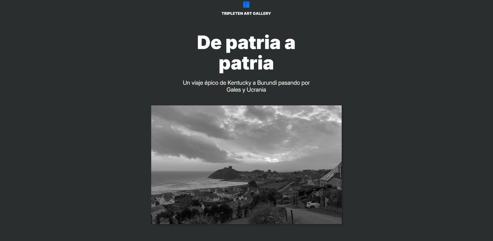
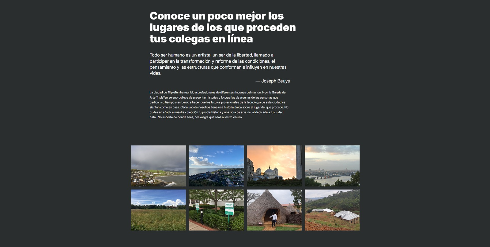
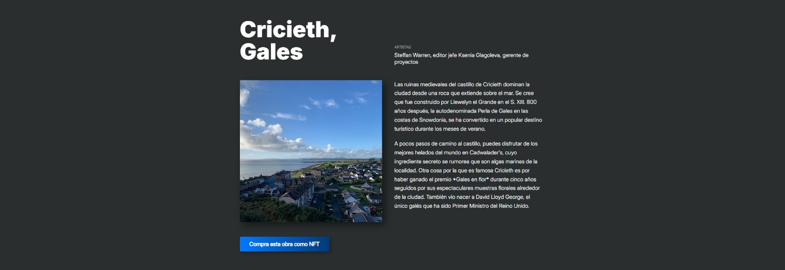
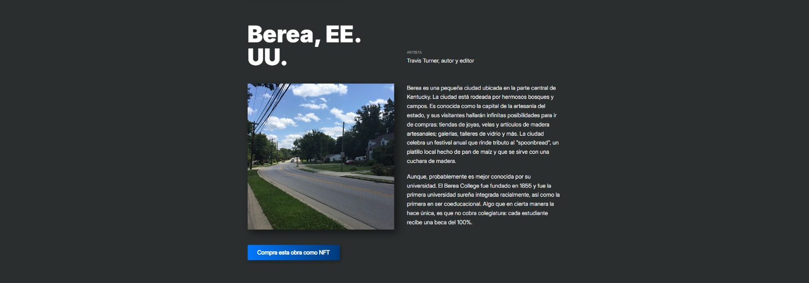
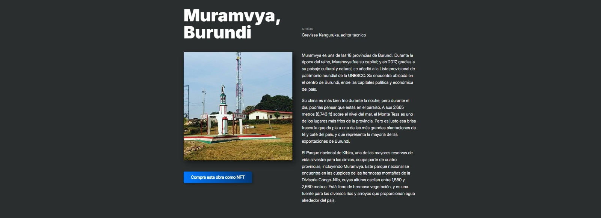
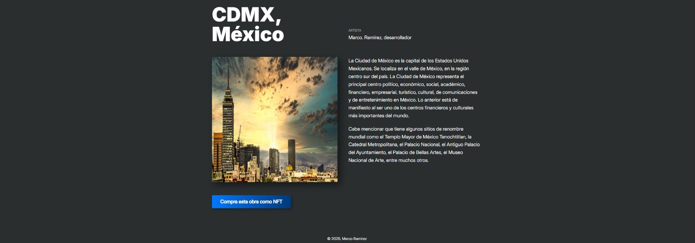

# TripleTen Art Gallery — De patria a patria

Es una **galería de arte digital** desarrollada completamente en **frontend**, que presenta una colección visual de paisajes y lugares representativos de distintas regiones del mundo.

El proyecto combina **diseño visual, narrativa y JavaScript moderno** para crear una experiencia inmersiva centrada en la exploración cultural a través de imágenes y texto.

Este proyecto fue desarrollado como parte del **programa de Desarrollo Web de TripleTen**.

---

# Preview

## Descripción del Proyecto

La galería presenta un recorrido visual titulado **“De patria a patria”**, un viaje simbólico que conecta distintos territorios, culturas y paisajes.  
Cada sección de la página representa un lugar específico, acompañado de imágenes y descripciones que aportan contexto histórico, cultural y geográfico.

El objetivo principal del proyecto es demostrar:

- Dominio del **frontend puro**
- Uso estructurado y semántico de HTML
- Maquetación moderna y responsiva
- Manipulación del DOM con JavaScript
- Organización clara del código y los estilos

---

## Tecnologías Utilizadas

### HTML5

- Estructura semántica del documento
- Uso correcto de encabezados, secciones y contenedores
- Organización clara del contenido para accesibilidad y SEO

### CSS3

- Diseño responsivo
- Flexbox y Grid para layout
- Control visual de tipografía, espaciado y jerarquía
- Estilos enfocados en una estética editorial / artística
- Adaptación a diferentes tamaños de pantalla

### JavaScript (ES6+)

- Manipulación del DOM
- Renderizado dinámico de contenido
- Uso de variables, funciones y métodos modernos
- Separación de lógica y presentación
- Código limpio, legible y mantenible

---

## Funcionalidades Principales

- Galería visual de imágenes artísticas
- Navegación vertical clara y fluida
- Secciones narrativas con contexto cultural
- Diseño totalmente responsivo
- Enfoque en experiencia de usuario y lectura visual

---

## Conceptos de JavaScript Aplicados

- Selección y manipulación de elementos del DOM
- Manejo de eventos
- Uso de funciones para estructurar la lógica
- Sintaxis moderna (ES6+)
- Separación de responsabilidades dentro del código

---
